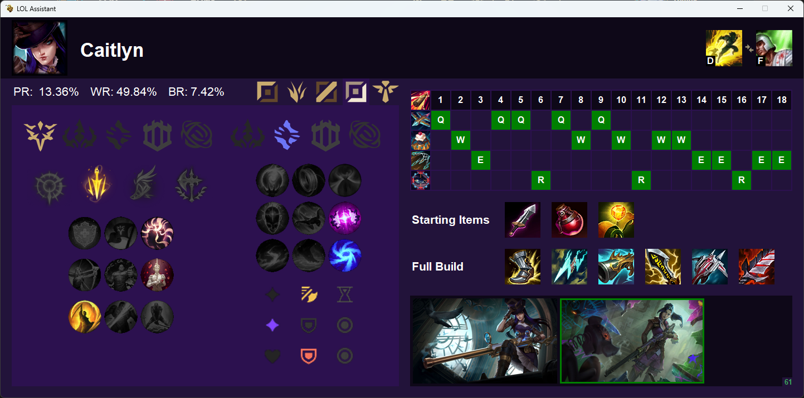
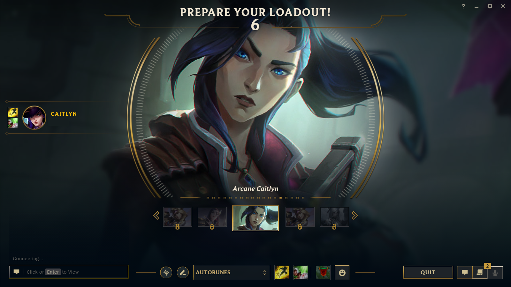
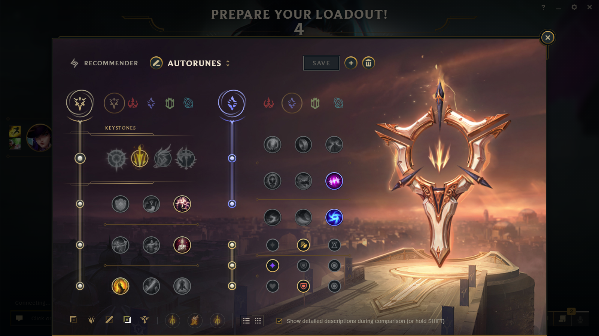
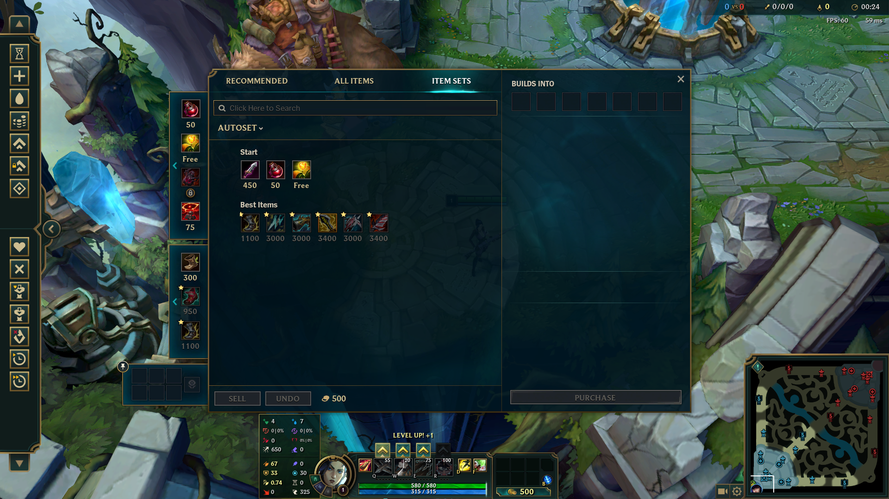

# LoLAutomation (PATCH 13.11)

## About The Project
This project is a Python-coded application. The primary objective of this project is to introduce automation to the League of Legends game. With the help of this program, players can automatically import Rune pages, spells, and items into the game during the League of Legends champion Select phase. Also, goal of this app is to help players by giving them the most common builds and champion ability level ups.

## Data
All information is supplied by METAsrc. A lot of helpful information is available on METAsrc, including details on builds, spells, skill order, and many other things. It includes information for the most popular game modes, including 5v5 and Aram. Users can choose between Pick rate and Win rate depending on the desired data.

## Setup and Prerequisites
### Python
Users must already have Python installed on their systems in order for this app to function properly. A few libraries are also necessary for effective operation. The file ```requirements.txt``` contains the necessary libraries. To install them, execute ```pip install -r requirements.txt``` on the terminal. 

### League of Legends
The tool that we provide, helps users to import runes, spells and item sets in the game automatically. To do so, the user need to make some changings into the game.
* On Collection tab -> Runes tab, create a new Rune page and rename it to AUTORUNES
* On Collection tab -> Items tab, create a new Item set and rename it to AUTOSET

### Execution
To execute the app you must run ```python main.py```. After that, LoLAutomation app will wait until the player selects a champion during the Champion Select phase.

## Runtime images
This is the GUI of our application


In the following image you can see the spells and the skin that has been set up automatically from our programm after champion pick.


The rune page has been updated.


The in game store shows up the most pick rated build.


## Future Goals
In this section, we provide some future goals about this project.

### Implementation
* Show one item with a counter for multiple identical items in shop set. 
* User can choose between pick rate and win rate
* Build and use our database for builds, skill order, rune pages.
* Choose between differend 3rd party platform (not only METAsrc) for taking data (including our webserver).

### Bugs
* There is a known bug about skin selection because of timing issues
* Remove some warmings


## Contact
Georgoulas Dimosthenis - dimosgeo99@gmail.com

Papanikolaou Nikolaos - nickp3065@gmail.com
